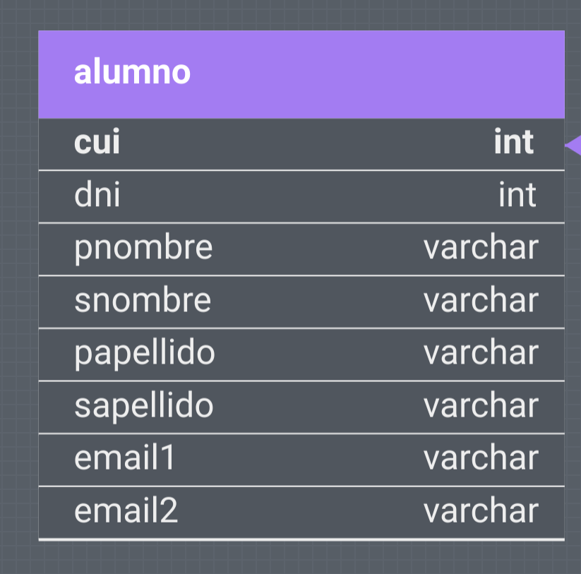
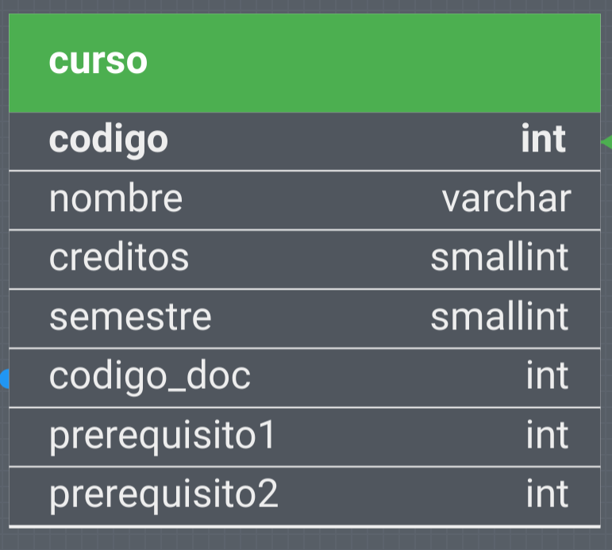
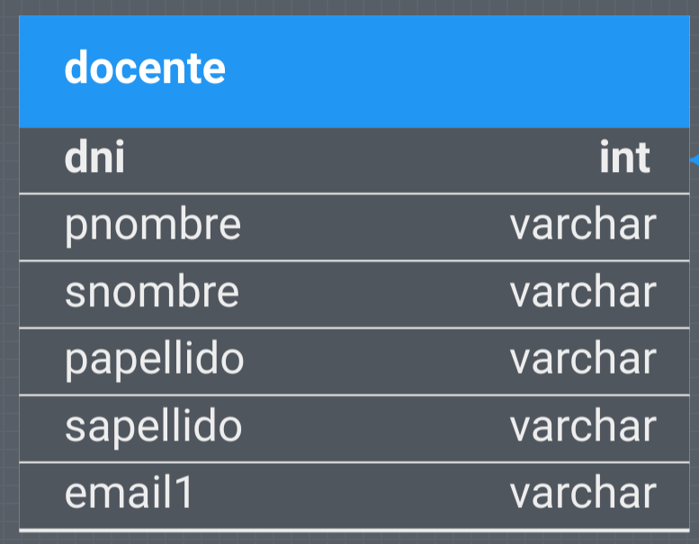
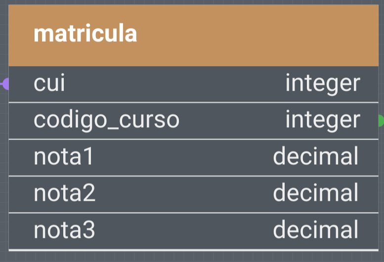

# Grupo 2

## Sistema completo

Web o apk, login que deja ambos

### Sistema de matriculas

- Notas, prerequisitos, semestres adecuados, no mucho adelantado, cupos, logins
- BD con lo necesario de $todo$ el salon

### (Ya no necesario??????)

- Todos los calculos posibles de notas
- Creditos, cupos, grupos(2 max), 40 personas

## Falta

- Algo de contrasenias??
- Promedio semestre anterior
  - Se necesita año de matricula
- Registro final de matriculas con servidor
  - Con meritocracia

## DB

### Operaciones

- Historial completo
- Cursos aprobados, jalados, matriculados
- Promedio, solo cuando tiene 3 notas
  - Por semestre: Se necesita saber cursos del anterior semestre(año y par/impar)
  - General: Todo menos los cursos que se llevan
- Semestre actual(mayor cantidad de cursos por semestre)
  - Contar max por semestre
  - Que pasa cuando no se esta llevando cursos, como se determina el semestre?????
  - Se determina el mayor semestre en los cursos aprobados??? O usando una mayoria los semestres de aprobados???
- Cursos que se pueden matricular
  - Asumimos cursos llevados como aprobados,

### Alumno

#### ??Cambios??

- BD general ya tiene email(falso), generar uno random para autenticar???
- -Anio de ingreso a carrera(no uni)-
- Anio de estudio

### Curso

### Docente

### Matricula

- Notas: -1, recien lo esta llevando
- 3 tipos, aprobado, llevando y jalado
- Se matricula curso jalado, se actualiza la entrada en la tabla

- Tenemos un sistema de matriculas
- Java con Spring Boot para el servidor y PostgreSQL para base de datos
- Primera pagina es estatica, segunda con thymeleaf
  - Todo demas es hecho en javascript, con request REST
- Cui no existentes da su error
- Pensando a futuro, los alumnos tienen cursos jalados en la BD
- Promedios(del historial), promedio general(de los promedios), aprobados, reprobados, historial, matriculados
- Nuestros matriculables se basan en:
    1. jalados
    2. semestre actual no tan alto
    3. cursos que esta llevando(Se es optimista, los asumimos como aprobados)
